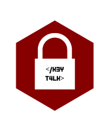

# KeyTalk

### Description
KeyTalk, as a proof of concept, is a simplistic password manager based around code generated by Github Copilot.  

### Etymology
The name is based on the code talker profession, we decided to use the word key because we are working with password security and encryption.

### Images

### 

### Autors

- Pablo Edu Diaz A.K.A **Exudev**
- Mariano Vasquez A.K.A **EnreiKazuri**
